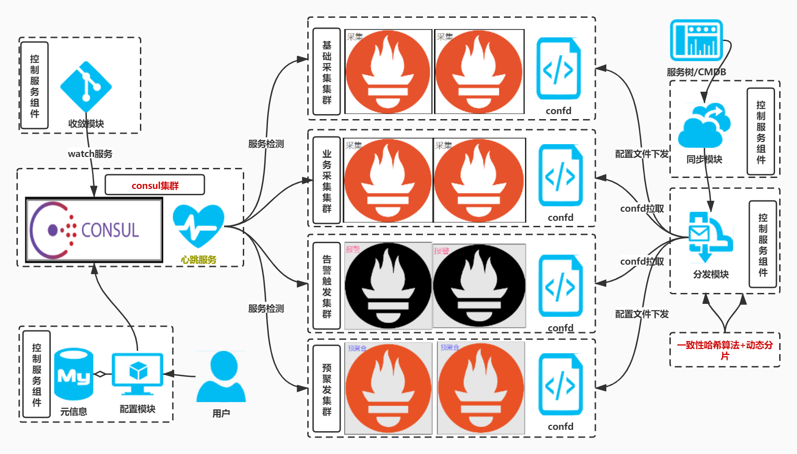
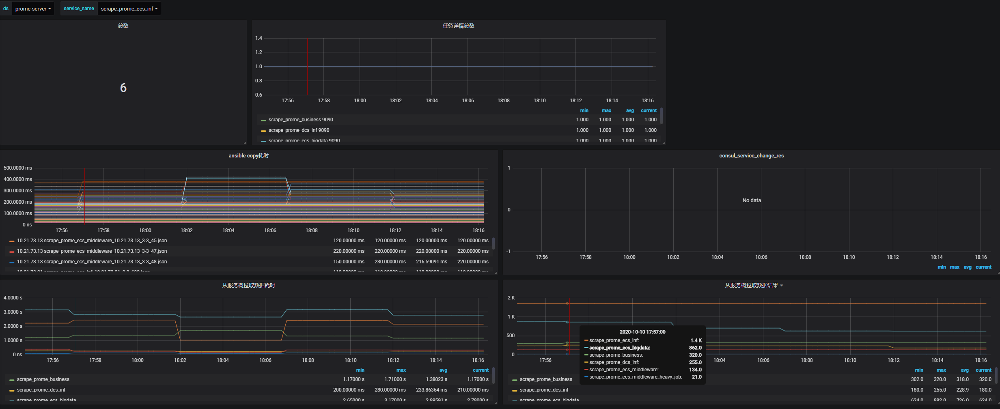
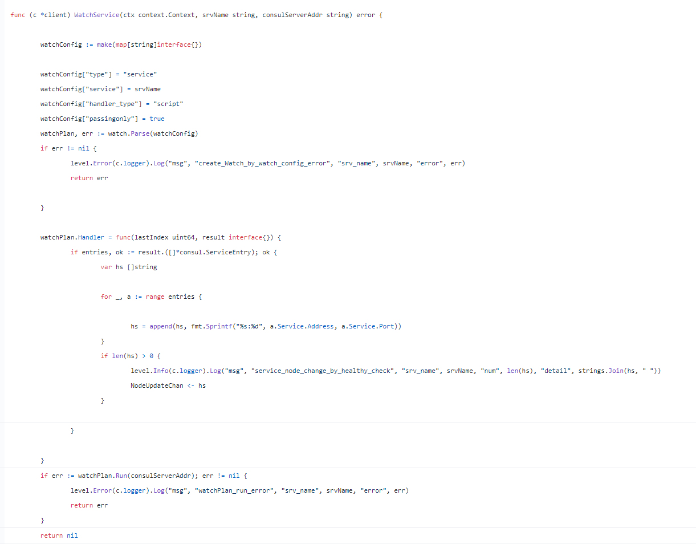

# 架构图


# 开源项目地址: 
项目地址: [https://github.com/ning1875/prome_shard](https://github.com/ning1875/prome_shard)

# 项目说明
## prometheus采集端单点问题
### 采集类型
- 采集机器级别的指标
- 采集k8s基础监控指标
- 采集部署在lb后面的vm业务指标
- 采集部署在pod里的业务指标
- 采集各种中间件的指标 如kafka zk clickhouse等
**面对如此复杂的采集类型，一般会使用一批采集Prometheus各司其职**
### sd发现问题
面对不同的采集来源，有对应的服务发现类型，如k8s_sd，我们修改Prometheus代码适配不同的服务发现类型，
- 比如有一些指标挂在lb的后面，需要通过lb的服务发现来感知后端server的变化
- 但是问题是每个采集器都是单点的，而且修改适配不同的发现源
- 当然也可可以无脑启动多个相同的采集器采集同一组jobs，配合remote_write等补足单点问题，但带来额外的成本开销
`各自适配不同发现源缺点总结`
- prometheus版本无法统一
- 配置文件五花八门
- 需要定义各种采集源或者sd方法

# 本项目介绍
使用一组采集器注册server到consul中，通过python反射运行定时任务，通过服务树等外部接口拿到targets池，一致性哈希分发给后端，统一通过file_sd生效，consul会对各组采集器实例做探活，当节点变化(宕机或扩容)会触发targets rebalance达到HA目的

## 架构说明
- 解析配置文件
- 同步注册服务到consul中
- 开启监听watch结果变化的消费者
- 异步watch各服务
- 触发/get_service生成哈希环
- 定时获取目标列根据哈希环生成各个节点的专属文件
- 通过ansible下发 sd_result文件并reload prometheus

**现有方式**
- 配置文件定义方法名称和对应的实例列表，在get_targets中反射定义对应的方法
- sd本质说明:均能转换成file_sd，只需要给出对应的 target结构体就可以


## consul watch问题
- golang 中

在golang中可以轻松做到，代码地址 [开源项目 : dynamic-sharding： 解决pushgateway HA问题](https://zhuanlan.zhihu.com/p/165205939) 
- 本项目 python中稍微复杂，需要改为blocking query
```python
def block_get_health(self, service_name, service_hash_map, dq):
    index = None
    while True:
        try:
            index, d = self.consul.health.service(service_name, passing=True, index=index)
            if d:
                data = d
                new_nodes = []
                for x in data:
                    address = x.get("Service").get("Address")
                    if address:
                        new_nodes.append(address)

                old_nodes = service_hash_map[service_name].nodes

                if set(old_nodes) != set(new_nodes):
                    logging.info("[new_num:{} old_num:{}][new_nodes:{} old_nodes:{}]".format(
                        len(new_nodes),
                        len(old_nodes),
                        ",".join(new_nodes),
                        ",".join(old_nodes),

                    ))
                    new_ring = ConsistentHashRing(100, new_nodes)
                    service_hash_map[service_name] = new_ring
                    dq.appendleft(str(service_name))
                    # dq.put(str(service_name))
                    M_SERVICE_CHANGES.labels(service_name=service_name, old_nodes=len(old_nodes),
                                             new_nodes=len(new_nodes)).set(len(new_nodes))
        except Exception as e:
            logging.error("[watch_error,service:{},error:{}]".format(service_name, e))
            time.sleep(5)
            continue

```


## 采集器单点/固定分片问题
- 无论是单点还是固定分片，都不是ha的，只要某一个分片的采集器挂了，那么损失对应的数据
- 采用consul_watch_service方式，根据返回的健康实例生成一致性哈希环
- 将target做分片分配给健康的节点采集即可

# 使用方法
```c
git clone https://github.com/ning1875/prome_shard
```

## 添加配置
填写config.yaml中的consul地址等
### 填写job 需要跟get_targets.py同步
get_targets.py 是prome_shard发现采集targets pool的方法
使用时需要实现 GetTarget的方法，方法名需要和config.yaml中相同
比如 在config.yaml中 有个job名为scrape_prome_ecs_inf
那么需要在 GetTarget中定义方法
    @classmethod
    def scrape_prome_ecs_inf(cls):
    
这个方法返回值是发现到的target列表，形如
```json
[{
    "labels": {
      "group": "SGT",
      "env": "prod",
      "service": "scrape_prome",
      "region": "ap-southeast-3",
      "scrape_type": "vm"
    },
    "targets": [
      "1.1.1.1:9090"
    ]
}]
 ```
prome_shard根据返回的targets池做一致性哈希分配给配置中定义好的nodes

